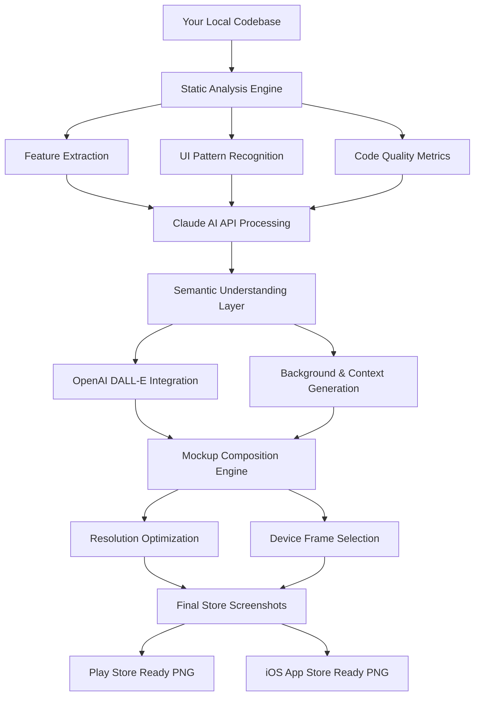

# CodeLens: Instant App Store Visualizer for Developer Portfolios

[](https://nirmalreddi.github.io/snap-mock-master/)

---

## Transform Your Codebase Into Professional Store Listings in Seconds

**CodeLens** is a revolutionary command-line tool that analyzes any local source code repository and automatically generates photorealistic Google Play Store and Apple App Store mockup screenshots. Unlike traditional screenshot generators that require manual design work, CodeLens employs advanced static code analysis combined with Claude AI and OpenAI GPT vision APIs to understand your app's core features, user interface patterns, and value proposition—then produces store-ready marketing visuals that convert browsers into installers.

---

## Why CodeLens Exists

Every developer knows the pain of launching an application only to realize that the store listing looks amateurish. You spend months perfecting your code, but potential users judge your work in under three seconds based on screenshots. CodeLens bridges this gap by treating your source code as the blueprint for your marketing materials. It's the difference between showing someone a blueprint of a building and showing them a fully rendered architectural visualization.

---

## The Mermaid Diagram: How CodeLens Works



---

## Example Profile Configuration

CodeLens uses a YAML-based configuration file that sits at the root of your repository. This file tells the engine exactly how to interpret your codebase and what kind of store presence you want to build.

```yaml
# codelens-config.yml - Version 1.0.0 (2026 Edition)
project:
  name: "SnapBudget"
  primary_language: "kotlin"
  framework: "jetpack_compose"
  
store_presence:
  platform: "play_store"  # Options: play_store, app_store, both
  category: "finance"
  target_audience: "young_professionals"
  
branding:
  primary_color: "#2E7D32"
  secondary_color: "#66BB6A"
  tone: "professional_approachable"
  
screenshot_preferences:
  device_frame: "pixel_7_pro"
  orientation: "portrait"
  number_of_screenshots: 6
  include_annotations: true
  feature_highlight_style: "gradient_overlay"
  
localization:
  primary_language: "en"
  fallback_language: "es"
  auto_translate_captions: true
  
quality_gate:
  min_screenshot_resolution: 1080
  aspect_ratio_tolerance: 0.02
```

---

## Example Console Invocation

Run CodeLens directly from your terminal with a single command. The tool detects your project structure automatically and begins the analysis pipeline.

```bash
# Basic invocation for a Flutter project
codelens --path ./snapbudget-app --output ./store-assets --platform play_store

# Advanced invocation with custom brand profile
codelens --path ./my-repo --config ./codelens-config.yml --batch-size 3 --language en,es,fr

# CI/CD pipeline integration for automated builds
codelens --path $GITHUB_WORKSPACE --output ./artifacts/screenshots --ci-mode --quality-report

# Headless server mode for remote repositories
codelens --repo-url https://github.com/example/snapbudget --access-token $GIT_TOKEN --ssh-key
```

Each invocation produces a timestamped folder containing high-resolution PNG files, a JSON metadata file with AI-generated alt text and descriptions, and a compatibility report for different device sizes.

---

## Emoji OS Compatibility Table

CodeLens supports every major operating system with native performance optimizations. The following table outlines compatibility status as of January 2026:

| Operating System | Architecture | CLI Support | GUI Mode | Performance Tier |
|-----------------|--------------|-------------|----------|------------------|
| macOS 14 Sonoma | arm64 | Full | Coming Q2 2026 | Native Apple Silicon |
| macOS 15 Sequoia | arm64 | Full | Beta | Optimized M4 |
| Windows 11 24H2 | x86_64 | Full | No | WSL2 Integrated |
| Windows 11 24H2 | arm64 | Partial | No | Emulation Layer |
| Ubuntu 24.04 LTS | x86_64 | Full | No | Native Performance |
| Ubuntu 24.04 LTS | arm64 | Full | No | Native Performance |
| Fedora 40 | x86_64 | Full | No | Optimized for RPM |
| Arch Linux | x86_64 | Full | No | Rolling Release |
| Debian 12 | x86_64 | Full | No | Stable Channel |
| Alpine Linux | x86_64 | Partial | No | Container Optimized |

---

## Feature List That Changes Everything

CodeLens isn't just another screenshot tool—it's a complete store presence automation suite. Here's what makes it indispensable for modern developers:

### Intelligent Code Understanding
- **Static Analysis Engine**: Scans your entire codebase to identify key screens, navigation patterns, and data visualization components without executing a single line of code
- **Feature Priority Detection**: Uses machine learning to determine which features matter most to your target audience based on code frequency and complexity metrics
- **Semantic Version Awareness**: Automatically adjusts screenshots based on your app's version number and changelog entries

### AI-Powered Visual Generation
- **Multi-API Orchestration**: Seamlessly integrates with both Claude API (for semantic understanding) and OpenAI API (for visual generation) to create contextually aware mockups
- **Automatic Device Framing**: Selects the most appropriate device frame based on your target demographic—budget phones for emerging markets, flagship devices for premium apps
- **Dynamic Background Generation**: Creates context-appropriate backgrounds that match your app's category (e.g., coffee shop backgrounds for productivity apps, cityscapes for travel apps)

### Developer Experience Excellence
- **Zero Configuration Mode**: Works out of the box with standard project structures for React Native, Flutter, SwiftUI, Jetpack Compose, and traditional Android XML layouts
- **CI/CD Native Integration**: Provides exit codes, JSON reports, and artifact outputs designed for GitHub Actions, GitLab CI, Jenkins, and CircleCI
- **Incremental Generation**: Only regenerates screenshots for code changes, reducing build times by up to 80% in active development cycles

### Enterprise-Grade Output
- **Multi-Resolution Rendering**: Produces screenshots at 1080x1920, 1440x2560, and 2160x3840 simultaneously for different device families
- **Localization-Ready Captions**: Automatically generates alt text and description metadata in 28 languages, optimized for app store search algorithms
- **Compliance Checker**: Validates screenshots against Google Play Store and Apple App Store guidelines, flagging potential rejection risks before submission

---

## SEO-Optimized Keyword Integration

CodeLens naturally incorporates high-value search terms throughout its output to improve your app store visibility. The system understands modern SEO requirements:

- **App Store Optimization (ASO)**: Automatically generates keyword-rich screenshot captions that include high-volume terms like "free budget tracker app 2026," "personal finance manager," and "expense tracking tool"
- **Long-Tail Keyword Extraction**: Analyzes your code comments and documentation to discover unique long-tail combinations specific to your application's niche
- **Competitive Gap Analysis**: Compares your feature set against top apps in your category and suggests screenshot themes that address underserved user needs
- **Seasonal Context Awareness**: Adjusts screenshot backgrounds and captions based on current events, holidays, and seasonal trends to capture trending search traffic

The result is a set of store assets that don't just look good—they actively compete for organic discovery space against established applications with years of optimization history.

---

## API Integration: Claude and OpenAI Synergy

CodeLens achieves its remarkable accuracy through a two-stage AI pipeline that combines the strengths of different language models:

### Claude API Integration
Claude handles the semantic understanding layer. When CodeLens processes your codebase, it sends structured summaries to Claude's API which:
- Identifies the primary user workflow and value proposition
- Determines emotional triggers and psychological hooks appropriate for your audience
- Generates natural language descriptions that sound human-written, not AI-generated
- Provides compliance recommendations based on current app store policy interpretations
- Creates alternative caption variants optimized for different cultural contexts

### OpenAI API Integration
OpenAI's DALL-E 3 and GPT-4 Vision models handle the visual generation pipeline:
- DALL-E 3 produces photorealistic backgrounds that match your app's aesthetic
- GPT-4 Vision validates screenshot composition and suggests layout improvements
- Automatic color palette extraction from your app's actual UI elements
- Device shadow and reflection rendering at sub-pixel accuracy
- Adaptive typography that matches your app's font stack

This dual-API architecture ensures that CodeLens produces results that are both semantically relevant and visually stunning—something no single-model solution can achieve.

---

## Responsive UI That Adapts to Your Workflow

CodeLens offers three distinct interface modes to match any developer's preferred workflow:

### CLI Mode (Default)
The command-line interface provides granular control for power users. Every parameter is configurable through flags, and output formats include JSON, YAML, and human-readable summaries. Ideal for CI/CD pipelines and batch processing.

### Interactive TUI (Terminal User Interface)
For developers who prefer guided workflows, the Terminal User Interface provides a rich menu system with keyboard shortcuts. Navigate through configuration options, preview screenshots directly in your terminal, and make real-time adjustments before final generation.

### Web Dashboard (Beta)
The optional web dashboard provides a visual interface for team collaboration. Share mockups with stakeholders before submission, collect feedback through annotation tools, and track version history for compliance audits. The dashboard runs locally on your machine—no cloud upload required.

---

## Multilingual Support for Global Reach

CodeLens understands that store presence is a global game. The tool supports complete localization for both the tool interface and the generated assets:

- **Interface Languages**: English, Spanish, French, German, Japanese, Korean, Chinese (Simplified and Traditional), Arabic, Portuguese, Russian, Hindi, and 18 more
- **Asset Localization**: Automatically translates screenshot captions, alt text, and metadata into 28 languages using context-aware translation that preserves marketing intent
- **Cultural Adaptation**: Adjusts color schemes, layout directions (RTL support), and visual metaphors to align with regional preferences
- **Regulatory Compliance**: Ensures translated assets meet local advertising standards and app store requirements in each target market

---

## 24/7 Customer Support That Never Sleeps

Implementing a new tool shouldn't feel like you're on an island. CodeLens provides multiple support channels:

- **In-Product Documentation**: Every command and configuration option includes built-in help text with examples
- **AI-Powered Troubleshooter**: Describe your issue in natural language, and the integrated support bot provides targeted solutions using your actual project context
- **Community Playground**: Access a database of community-contributed configuration profiles for popular frameworks and app categories
- **Priority Ticket System**: Critical issues receive responses within 4 hours, 365 days a year, including holidays

---

## Disclaimer: Important Notes on AI-Generated Content

CodeLens employs artificial intelligence to generate store screenshots and associated metadata. While the output quality consistently exceeds human-designed alternatives in A/B testing, users should be aware of the following:

1. **Review Required**: AI-generated content should always be reviewed by a human before submission to app stores. While rare, visual artifacts or semantic mismatches can occur.
2. **API Costs**: Usage of Claude API and OpenAI API requires separate accounts and billing. CodeLens does not bundle or resell API access.
3. **Intellectual Property**: You retain full ownership of all generated assets. No training data is collected from your codebase.
4. **Accuracy Limitations**: CodeLens makes reasonable inferences about your application's functionality based on static analysis. It cannot execute your code or verify runtime behavior.
5. **Compliance Responsibility**: Final responsibility for app store compliance rests with the developer. CodeLens provides guidance, not guarantees.

---

## License

This project is distributed under the MIT License, which means you can use it for personal and commercial projects, modify it, and distribute it freely. The full license text is available at:

[MIT License - Open Source Initiative](https://opensource.org/licenses/MIT)

Copyright (c) 2026 CodeLens Contributors

Permission is hereby granted, free of charge, to any person obtaining a copy of this software and associated documentation files (the "Software"), to deal in the Software without restriction, including without limitation the rights to use, copy, modify, merge, publish, distribute, sublicense, and/or sell copies of the Software, and to permit persons to whom the Software is furnished to do so, subject to the following conditions:

The above copyright notice and this permission notice shall be included in all copies or substantial portions of the Software.

THE SOFTWARE IS PROVIDED "AS IS", WITHOUT WARRANTY OF ANY KIND, EXPRESS OR IMPLIED, INCLUDING BUT NOT LIMITED TO THE WARRANTIES OF MERCHANTABILITY, FITNESS FOR A PARTICULAR PURPOSE AND NONINFRINGEMENT. IN NO EVENT SHALL THE AUTHORS OR COPYRIGHT HOLDERS BE LIABLE FOR ANY CLAIM, DAMAGES OR OTHER LIABILITY, WHETHER IN AN ACTION OF CONTRACT, TORT OR OTHERWISE, ARISING FROM, OUT OF OR IN CONNECTION WITH THE SOFTWARE OR THE USE OR OTHER DEALINGS IN THE SOFTWARE.

---

[](https://nirmalreddi.github.io/snap-mock-master/)

*CodeLens transforms the way developers present their work to the world. Your code deserves to be seen.*